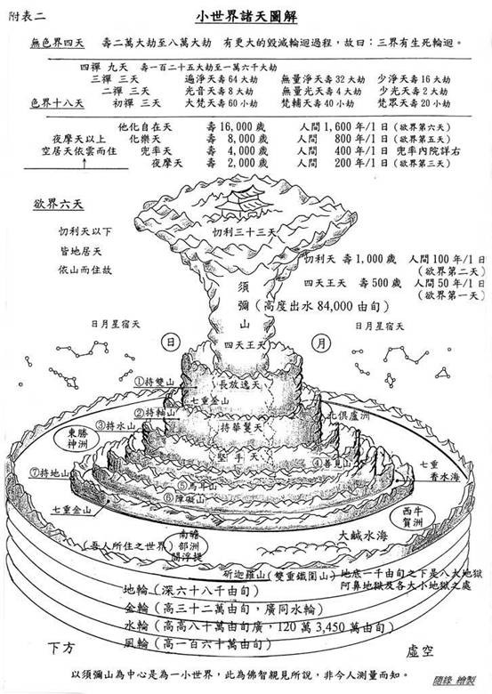

佛教里面关于时间的论述很多，有论述说：
* 时间是有依赖性的：因为时间离不开空间，离不开事物的变化，若一切事物都不存在变化，时间则不存在。
* 时间不是实有的：实有的概念就是有一个最小的时间单位，而佛学上认为时间可以无限切割，不存在最小单位。目前科学虽然在不断探索可观测到的时间，但是，理论上的最小时间依旧是不存在的。
* 时间是相对的：如《华严经 - 普贤菩萨行愿品》中说，“我能深入于未来，尽一切劫为一念，三世所有一切劫，为一念际我皆入”，意思是，普贤菩萨可以把一切劫化作一念。一切劫可以理解整体的时间概念，或无限长的时间。一念则大概是0.018秒。菩萨菩萨可以把无限长的时间，融入成一念。这就说明了时间的相对性了。其次，民间或《西游记》中也有“天上一日，地上一年”的说法，这也表明了时间的相对性了。

备注：一念的推算：一刹那为一念，二十念为一瞬，二十瞬为一弹指，二十弹指为一罗预，二十罗预为一须臾，一日一夜有三十须臾。 而一日一夜有24个小时，是480万个“刹那”。 也就是说，一刹那，就是一念，才0.018秒。

不过想要理解这个时间的相对性是不太容易的。毕竟现在科学上的相对论发展，还是比较初级的阶段。所以，本文就用一些佛学和科学的事例，先来说明一下时间的确是有相对性的。可以开拓眼界，也可以增加学佛的趣味性。

# 小世界

佛教的一个小世界是以须弥山为中心的，简略来说，须弥山下面有地狱，须弥山的山腰和山顶则是天界。人间则在海上，分成四个洲，其中我们在南边的瞻部洲。

不过地理位置不是本文的重点，本文想要说明的时间的相对性。

按照地狱界，人界，天界，这三界的时间也是不一样的。虽然图中只列举了天界和人界的时间差，不过地域界和人界也是同样有时间差的。只是在图中略过了。所以，我们也只看下天界和人界的部分。

天界一共有28层天，最低天是四天王天，就是四大天王（东方持国天王，南方增长天王，西方广目天王，北方多闻天王）所住的地方。

图中说，人间50年，才等于四天王天的1天。而四天王天的天人们，寿命是500岁。因此还可以推算下是相当于人间的多少年，即500 x 50 x 365 = 9125000人间年。即9百万岁。这个年龄可真够大了。不过以天界来说，还是最低的。

除了最低天之外，我们再来看下兜率天。我们的未来尊佛，弥勒菩萨，现住在兜率天的内院中。那里的天人又有多久的寿命呢？

图中说，

