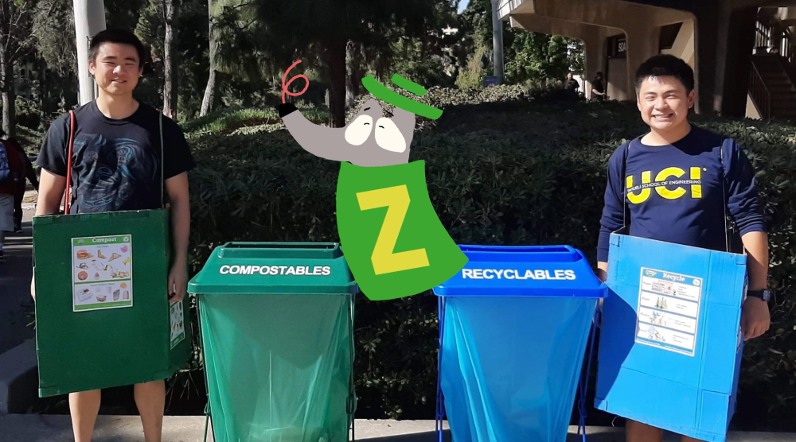

ZotBins is system of Smart Waste Bins with a suite of web-based applications to collect and analyze real-time waste data. Through IoT, ZotBins is able to use waste data to encourage zero waste practices from a behavioral approach while also demonstrating use of quantifiable data to holistically improve waste systems. This system has been able to help find useful waste related insights at the University of California, Irvine. To learn more visit https://[zotbins.github.io](zotbins.github.io) or view our video by clicking on the image below:

## Mission
To better inform all actors in the [Municipal Solid Waste](https://en.wikipedia.org/wiki/Municipal_solid_waste) Stream system and help close the [loop](https://en.wikipedia.org/wiki/Circular_economy) for a sustainable society.

## Goals

1. Help organizations/communities reach a **85% waste diversion rate or more**
2. Help individuals reduce the average per person disposal rate of [1,704 lbs.](https://www.globalcitizen.org/en/content/americans-produce-most-waste/) per year (in the United States) by **66% or more**

## How it Started
In 2017, a team of undergraduate students at the University of California, joined a Hackathon hosted by [UCI TIPPERS](http://tippers.ics.uci.edu/) and created ZotBins to help make waste management more efficient while also encouraging more zero waste practices. With the guidance of professors and graduate students from the TIPPERS research group, the team was able to grow from 4 to over 15 individuals all working on the ZotBins project. Together they have been able to build and deploy a network of 9 smart bins on campus that are currently making a positive impact for UCI.

Owen Yang, who was one of the co-founders of ZotBins graduated from UCI and now with ZotBins Community Edition (ZBCE), he intends to further work with the new [ZotBins](https://zotbins.github.io) team to help further expand the concept of ZotBins where any city, business, university, classroom, or home could implement a smart waste system.

## ZBCE Team
This ZBCE project was initiated by [Owen Yang](https://okyang.github.io). It currently has a few people in the community and has a strong connection with the ZotBins team at UCI.

## ZBCE 4-layer IoT Architecture

## Values
#### 🙌 *Supportive Community*

A supportive community where all members are able to grow and help mentor or learn from one another. Healthy communities are to be inclusive, welcoming, and respectful of one another.

#### 🌱 *Environmental Sustainability*

Protecting the environment and helping preserve our planet's biodiversity is critical. Doing our part in supporting sustainable practices is morally important to sustain future generations.

#### 🔒 *Privacy and Using Data Ethically*

When data is collected, users involved have their right to privacy and any data collected is used ethically. All applications developed will be developed with privacy in mind. We will never try to sell personal data for profit.

#### 🎇 *Passion*

Pursuing our passions and being motivated to take initiative. That's how this project started!

## Public Roadmap
ZBCE is just getting started and there's a long way to go. Here is our [Road Map](https://github.com/orgs/zotbins/projects/9)

## Contributing
This project is not all about coding. It also requires a vast set of skills including digital design, documentation, feedback, and more. All contributions are important to help this project thrive, not just the ones from pull requests.

Here are some following ways you can contribute:
- Join the [Discord](https://discord.gg/mGKVVpxTPr) server and contribute to our growing community
- Submit bugs by opening an issue on our [Github](https://github.com/zotbins). Please make sure that bugs are reported in detail and is reproducible.
- Write some documentation for a [ZBCE repository](https://github.com/orgs/zotbins/teams/community-edition/repositories) and we can add it to our GitHub Wiki Page
- Look for open issues on our [ZBCE repositories](https://github.com/orgs/zotbins/teams/community-edition/repositories)
- Suggest new features in our Discord Server
- Contribute to crowd-sourcing projects. Occasionally, there will be certain projects that require crowd-sourced data.
- Submit user feedback through feedback forms or polls in our Discord community
- Lookout for more requests for help on our Discord server

Any help is really appreciated. For more ideas about how you can contribute to open source projects feel free to message community members on [Discord](https://discord.gg/mGKVVpxTPr) or take a look GitHub's [Open Source Guides](https://opensource.guide/how-to-contribute/).

## Contact
[zotbinsuci@gmail.com](mailto:zotbinsuci@gmail.com)
